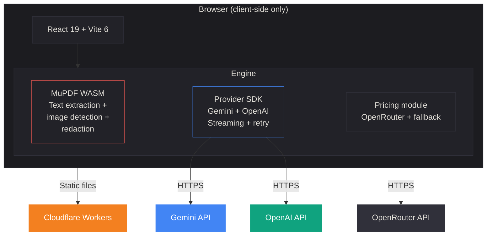
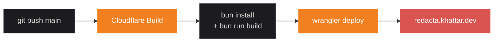

<div align="center">


# Redacta

**AI-powered PDF redaction and pseudonymisation, entirely in your browser.**

Describe what to redact in plain language. AI identifies it. MuPDF removes it permanently.
Your documents never leave your device.

[](LICENSE)
[](https://typescriptlang.org)
[](https://react.dev)
[](https://vite.dev)
[](https://workers.cloudflare.com)

[Live App](https://redacta.khattar.dev) · [Report Bug](https://github.com/Siddharth-Khattar/redacta/issues)

<br />

<a href="https://ko-fi.com/siddharthkhattar"></a>

</div>

---

## How It Works


1. **Upload** a PDF via drag-and-drop or file picker
2. **Describe** what to redact in plain language (e.g. *"all personal names and phone numbers"*)
3. **AI** analyses every page and identifies exact text matches and sensitive images
4. **Choose** to permanently redact (black out) or pseudonymise (replace with realistic fakes)
5. **Download** the redacted document with original formatting preserved

Everything happens client-side. The PDF is processed by MuPDF compiled to WebAssembly, and AI providers are called directly from your browser using your own API key. No backend. No server. No data leaves your machine.

---

## Features

### Redaction & Pseudonymisation
- **Natural language redaction** — describe what to censor, not where it is
- **Pseudonymisation mode** — replace real PII with realistic fictional alternatives (names, addresses, IDs) instead of blacking out, preserving document readability
- **Permanent or visual** — irreversible text destruction or black-box overlays
- **Image redaction** — detect and redact photos, signatures, logos, and screenshots embedded in PDFs with configurable fill colours and labels

### AI Models
- **Multi-provider support** — bring your own Gemini or OpenAI API key
- **5 models** — Gemini 2.5 Flash, 3.0 Flash, 3.1 Pro · GPT-5.4, GPT-5.4 Mini
- **Configurable thinking depth** — minimal to high reasoning for complex documents
- **Live cost estimation** — token counts and USD cost displayed after each run

### Workspace
- **Split-pane viewer** — original and redacted PDFs side by side, resizable
- **Post-processing controls** — adjust highlight colours, image fill, and label visibility after redaction without re-running AI
- **Dark & light themes** — respects system preference, toggleable
- **Per-provider key management** — separate API keys for each provider, stored locally

---

## Supported Models

| Model | Provider | Thinking Levels | Best For |
|---|---|---|---|
| Gemini 2.5 Flash | Google | Low · Medium · High | Fast, cost-effective redaction |
| Gemini 3.0 Flash | Google | Minimal · Low · Medium · High | Balanced speed and accuracy |
| Gemini 3.1 Pro | Google | Low · Medium · High | Complex documents, highest accuracy |
| GPT-5.4 | OpenAI | Low · Medium · High | High-quality reasoning |
| GPT-5.4 Mini | OpenAI | Low · Medium · High | Fast OpenAI alternative |

<details>
<summary><strong>Pricing (per million tokens)</strong></summary>

| Model | Input | Output | Thinking |
|---|---|---|---|
| Gemini 2.5 Flash | $0.15 | $0.60 | $0.60 |
| Gemini 3.0 Flash | $0.50 | $3.00 | $3.00 |
| Gemini 3.1 Pro | $2.00 | $12.00 | $12.00 |
| GPT-5.4 | $2.50 | $15.00 | $15.00 |
| GPT-5.4 Mini | $0.75 | $4.50 | $4.50 |

Prices fetched live from [OpenRouter](https://openrouter.ai) with a 6-hour cache. Falls back to bundled defaults if unavailable.

</details>

---

## Quick Start

### Prerequisites

- [Bun](https://bun.sh) (or Node.js 18+)
- A [Gemini API key](https://aistudio.google.com/apikey) and/or [OpenAI API key](https://platform.openai.com/api-keys)

### Run locally

```bash
make setup    # Install dependencies
make dev      # Start dev server (http://localhost:5173)
```

Enter your API key when prompted.

### Production build

```bash
make build    # TypeScript check + production build
make preview  # Build + serve locally
```

---

## Architecture



The entire application compiles to static files. Cloudflare Workers serves them with proper WASM headers and SPA routing. There is no server-side code.

---

## Privacy & Security

| Concern | How it's handled |
|---|---|
| **PDF content** | Processed in-browser via WASM. Never uploaded anywhere. |
| **API keys** | Stored per-provider in `localStorage`. Sent only to the respective AI provider. |
| **AI requests** | Direct browser-to-API calls. No proxy, no middleman. |
| **Redacted output** | Exists only in browser memory until downloaded. |
| **Analytics / tracking** | None. Zero telemetry. |
| **CSP** | Strict Content-Security-Policy. Only allows Gemini API and OpenRouter. |
| **Security headers** | `X-Frame-Options: DENY`, `nosniff`, `strict-origin-when-cross-origin` referrer policy. |

---

## Development

### Commands

| Command | Description |
|---|---|
| `make setup` | Install dependencies |
| `make dev` | Dev server with hot reload |
| `make build` | TypeScript check + production build |
| `make preview` | Build + preview production bundle |
| `make format` | Auto-format with Biome |
| `make lint` | TypeScript + Biome checks |
| `make check` | Format + lint (full quality gate) |
| `make deploy` | Build + deploy to Cloudflare Workers |
| `make clean` | Remove `node_modules` and `dist` |

### Tech Stack

| Layer | Technology |
|---|---|
| Framework | React 19 |
| Build | Vite 6 |
| Language | TypeScript 5.7 |
| Styling | Tailwind CSS 4 |
| Animation | Motion (Framer Motion) |
| PDF Engine | MuPDF 1.27 (WASM) |
| AI Providers | Google GenAI SDK, OpenAI (HTTP) |
| Routing | Wouter |
| Icons | Lucide React |
| Lint / Format | Biome |
| Hosting | Cloudflare Workers |

### Project Structure

```
frontend/
├── public/
│   ├── brand/                 Icon + lockup SVGs (dark, light, transparent)
│   ├── favicon.svg            Browser tab icon
│   ├── apple-touch-icon.png   iOS home screen icon
│   ├── og-image.png           Social sharing preview (1200×630)
│   ├── robots.txt             Crawler directives
│   ├── sitemap.xml            XML sitemap
│   └── _headers               Cloudflare caching + security headers
├── src/
│   ├── engine/
│   │   ├── types.ts           Shared types, error class, image/redaction settings
│   │   ├── pdf.ts             MuPDF WASM: text extraction, image detection, redaction
│   │   ├── orchestrator.ts    Pipeline: extract → identify → redact → cost
│   │   ├── pricing.ts         OpenRouter pricing fetch + 6-hour cache
│   │   ├── providers/
│   │   │   ├── types.ts       Provider interface and model definitions
│   │   │   ├── registry.ts    Model catalog and provider factory
│   │   │   ├── shared.ts      Shared prompt building and response parsing
│   │   │   ├── gemini.ts      Google Gemini streaming client + retry
│   │   │   └── openai.ts      OpenAI HTTP client + retry
│   │   └── prompts/
│   │       ├── index.ts       Prompt selector (redaction vs pseudonymisation)
│   │       ├── redaction.ts   System prompt for PII identification
│   │       └── pseudonymisation.ts  System prompt for PII replacement
│   ├── hooks/
│   │   └── useProviderKeys.ts Per-provider localStorage key management
│   ├── api/
│   │   └── redaction.ts       Adapter: engine to UI contract
│   ├── lib/
│   │   ├── pdf-store.ts       IndexedDB PDF persistence across routes
│   │   └── utils.ts           Shared utilities (cn, etc.)
│   ├── components/
│   │   ├── Header.tsx         Navigation, Ko-fi, GitHub link, theme toggle
│   │   ├── ApiKeyModal.tsx    Multi-provider API key management
│   │   ├── PromptPanel.tsx    Prompt input, model/mode/thinking selectors
│   │   ├── PdfPanel.tsx       PDF viewer (iframe-based)
│   │   ├── ProcessingPanel.tsx  Progress indicator with scan animation
│   │   ├── ResultPanel.tsx    Results + post-processing controls
│   │   ├── RedactionWorkspace.tsx  Split-pane layout orchestration
│   │   ├── DownloadBar.tsx    Download controls
│   │   ├── RedactaLogo.tsx    SVG logo component
│   │   ├── ScanOverlay.tsx    Animated scan line effect
│   │   ├── hooks/
│   │   │   ├── use-screen-size.ts        Responsive breakpoint detection
│   │   │   └── use-debounced-dimensions.ts  Debounced resize handling
│   │   └── ui/
│   │       └── pixel-trail.tsx  Interactive cursor trail effect
│   ├── pages/
│   │   ├── LandingPage.tsx    Hero, feature pills, upload CTA, trust marquee
│   │   └── WorkspacePage.tsx  Workspace orchestration
│   ├── App.tsx                Router, theme, API key modal
│   ├── index.css              Tailwind theme tokens (dark + light)
│   └── main.tsx               Entry point
├── index.html                 Meta tags, structured data, noscript fallback
├── vite.config.ts
└── package.json
wrangler.jsonc                 Cloudflare Workers deployment config
Makefile                       Dev workflow commands
```

---

## Deployment

Redacta deploys as a static site on Cloudflare Workers. Push to `main` triggers automatic deployment.



### Cloudflare build settings

| Setting | Value |
|---|---|
| Build command | `cd frontend && bun install && bun run build` |
| Deploy command | `npx wrangler deploy` |

---

## License

[MIT](LICENSE) · Siddharth Khattar, 2026
